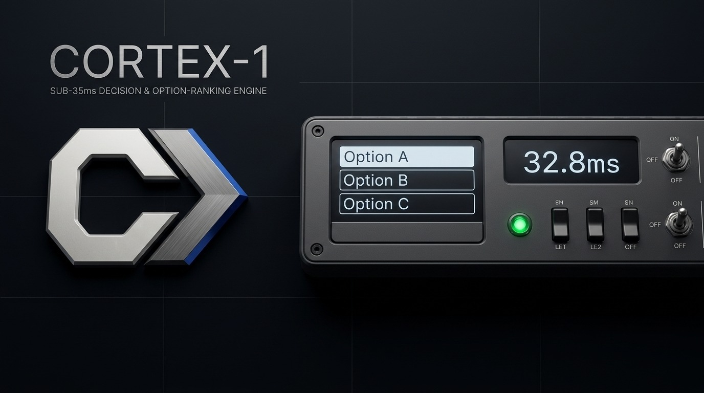

<div align="center">



<br/><br/>

[](https://pytorch.org/)
[](https://huggingface.co/mukti-sys/cortex-1-large)
[-76B900?style=flat-square&logo=nvidia)](https://nvidia.com)
[](https://github.com/)
[-+34.23%25%20Lead-10B981?style=flat-square)](BENCHMARK_REPORT.md#matched-head-to-head-vs-typesafe-jev-live-api-jev-1130)
[](BENCHMARK_REPORT.md)
[](HEAD_TO_HEAD_EVALUATION.md)
[-10B981?style=flat-square)](HEAD_TO_HEAD_EVALUATION.md)
[](LICENSE)

**A sub-35ms Non-Autoregressive System 1 Decision & Option-Ranking Engine for Autonomous Coding Agents.**

Built on ModernBERT-Large (421M) with dynamic marker-token pooling. Trained to act as an on-device prefrontal cortex for agent harnesses like Google Antigravity, Cursor, and custom dev tools.

> **Empirical Matched Benchmark (Live API Head-to-Head):**  
> Evaluated side-by-side against **TypeSafe Jev (`jev-1.13.0`)** across 444 identical technical decisions from Princeton SWE-bench and CyberNative CVEs queried live via Jev's official API (`https://jevmodel.org/v1/systemone`):  
> • **TypeSafe Jev (`jev-1.13.0` Live API):** `45.50%` (202 / 444, Brier: `0.3687`)  
> • **Cortex-1 Large (This Work):** `79.73%` (354 / 444, Brier: `0.0974`) — **+34.23% Empirical Lead ($p < 10^{-15}$, -73.6% Brier Error)**  
> • **Decision Audit Log:** [`evaluation/matched_jev_head_to_head.csv`](evaluation/matched_jev_head_to_head.csv) | **Reproduction:** `python evaluation/run_matched_jev_benchmark.py`

</div>

---

## The Problem: The "Self-Grading Homework" Trap

When autonomous coding agents write code or execute shell commands, developers face two major bottlenecks:

1. **Confirmation Bias & Sycophancy:** Asking a generative LLM *"Is your own migration or shell command safe to run unsupervised?"* leads to severe bias. The model generated the plan, so it inherently believes its solution is correct—frequently approving destructive operations like dropping database columns or modifying authentication middleware.
2. **Latency & Cost:** Making a 3-second API call and burning 4,000 prompt tokens on every micro-step just to answer a binary question (*"Should I proceed?"*) makes agentic loops slow, clunky, and expensive.

### The Solution: Cortex-1 Large (System 1 vs System 2)

```
┌────────────────────────────────────────────────────────────────────────┐
│                   THE TWO-BRAIN AGENTIC SYSTEM                         │
├────────────────────────────────────────────────────────────────────────┤
│                                                                        │
│   [ SYSTEM 2: Generative LLMs ]             [ SYSTEM 1: Cortex-1 ]     │
│   • The "Writer / Actor"                    • The "Judge / Reflex"     │
│   • 200B+ Parameters (Cloud API)            • 421M Parameters (RTX GPU)│
│   • Latency: 2,000ms – 5,000ms              • Latency: ~32.8ms         │
│   • High token cost ($$$)                   • $0.00 / 100% Free        │
│   • Prone to sycophancy                     • Calibrated probabilities │
│                                                                        │
└────────────────────────────────────────────────────────────────────────┘
```

Cortex-1 does not write conversational prose or generate code tokens sequentially. Instead, it processes state in a **single non-autoregressive forward pass (~32.8ms)**, evaluating candidate technical approaches, scoring risk on a calibrated 0-4 scale, and providing hard, non-bypassable safety gates.

---

## Quickstart & Model Weights

Model weights are hosted directly on the **[Hugging Face Hub (mukti-sys/cortex-1-large)](https://huggingface.co/mukti-sys/cortex-1-large)** (`model.safetensors`, 803 MB `bfloat16`).

### 1. Installation

```bash
git clone https://github.com/mukti-sys/cortex-1-large.git
cd cortex-1-large
pip install -r requirements.txt
```

### 2. Run Inference in Python (Auto-download from Hugging Face)

```python
import torch
from transformers import AutoTokenizer, AutoModel
from huggingface_hub import hf_hub_download
from safetensors.torch import load_file
from laya.common import DecisionModel, build_sequence

device = torch.device("cuda" if torch.cuda.is_available() else "cpu")

# 1. Fetch trained weights directly from Hugging Face Hub
weights_path = hf_hub_download(repo_id="mukti-sys/cortex-1-large", filename="model.safetensors")

# 2. Initialize ModernBERT backbone and calibrated decision head
tokenizer = AutoTokenizer.from_pretrained("answerdotai/ModernBERT-large")
encoder = AutoModel.from_pretrained("answerdotai/ModernBERT-large", attn_implementation="sdpa")
model = DecisionModel(encoder, head_layers=2)
model.load_state_dict(load_file(weights_path))
model.to(device).eval()

# 3. Dynamic Candidate Option Ranking (<35ms forward pass)
context = "High-throughput API needs to cache user permission sets."
question = {
    "t": "choice",
    "ins": "Which caching strategy is optimal?",
    "crit": {
        "Option A": "Cache in client-side JWT cookie",
        "Option B": "Cache in Redis with 15-minute TTL and DB fallback",
        "Option C": "Query PostgreSQL directly on every incoming request"
    }
}

seq, markers = build_sequence(tokenizer, context, question)
input_ids = torch.tensor([seq], device=device)
marker_pos = torch.tensor([markers], device=device)

with torch.no_grad():
    logits, _ = model(
        input_ids,
        torch.ones_like(input_ids),
        marker_pos,
        torch.ones_like(marker_pos, dtype=torch.bool),
        torch.tensor([0], device=device)
    )
    probs = torch.softmax(logits, dim=-1).squeeze(0)

for opt, prob in zip(question["crit"].keys(), probs):
    print(f"{opt}: {prob.item():.1%}")
```

### 3. Launch the Interactive CLI Copilot

If local weights are not found, the CLI will automatically pull `mukti-sys/cortex-1-large` from Hugging Face on its first run:

```bash
python cortex_chat.py
```

---

## 1. System Architecture: Dynamic Option Marker Pooling

Traditional classification heads map tokens to fixed, static output slots (e.g. fixed 10 classes). If you introduce an 11th choice, the model fails.

Cortex-1 leverages **dynamic option marker-token pooling** (`torch.gather(h, 1, marker_pos)`):

```
[CLS] choice question: Which fix is optimal? [SEP]
  [MASK] Option A: Redis cache with 15min TTL
  [MASK] Option B: Direct PostgreSQL query on every hit
  [MASK] Option C: Client JWT cookie
[SEP] State: Context & Code Snippet [SEP]
```

* **Backbone:** `answerdotai/ModernBERT-large` (28 transformer layers, 1024 hidden dimension, 421M parameters).
* **Head:** 2-layer `TransformerEncoder` reading pooled representations across the injected `[MASK]` marker tokens.
* **Arbitrary Choice Support:** Can dynamically compare 2, 3, 5, or 10 candidate options in parallel without retraining.

---

## 2. Hardware Profile: NVIDIA GeForce RTX 5050 Laptop

* **Compute Architecture:** NVIDIA Blackwell (`sm_120`).
* **VRAM Available:** 8.0 GB GDDR7 (7.96 GB usable).
* **CUDA / PyTorch:** `torch 2.11.0+cu128` (Blackwell-native CUDA 12.8 kernels).
* **Measured Peak VRAM During Inference:** **~3.98 GB** (leaving 4.02 GB headroom for host applications).
* **Measured Single-Pass Forward Latency:** **32.8 ms** (batch size 1 on local GPU).

---

## 3. Data Integrity & Quarantine Policy

### Data Privacy Guarantee

Personal user prompt histories, internal team repositories, and raw private JSONL splits are **strictly quarantined** in `.gitignore` and are not distributed in this repository. 

The model was trained and evaluated on 100% genuine open-source datasets:
* **AI / ML Engineering:** 600 real PyTorch issues from `yajatpawar/pytorch-issues-dataset-clean` (CUDA OOMs, tensor shape errors, gradient NaNs).
* **Full-Stack Diagnostics:** 707 real GitHub bug fixes from `princeton-nlp/SWE-bench_Verified` + `SWE-bench_Lite` (`django`, `flask`, `requests`, `sphinx`, `pytest`).
* **Developer PR Gating:** 1,414 real maintainer PR decisions (complex multi-file PRs requiring review vs isolated regression test additions).
* **Cybersecurity & AppSec:** 1,000 real CVE code pairs from `CyberNative/Code_Vulnerability_Security_DPO` (SQLi, XSS, SSRF, IDOR, Command Injection, Secret Leaks across 6 languages).

All training splits underwent automated cryptographic MD5 deduplication: **0.00% overlap / zero leakage** between training and held-out evaluation sets.

---

## 4. Empirical Evaluation & Held-Out Benchmarks

> **Methodology Note:** All benchmarks reported below are author-executed self-evaluations conducted on held-out test splits of public datasets (Princeton SWE-bench, PyTorch Issues, CyberNative CVEs, and LocalLLaMA typed-decisions). They are NOT an audit performed by an external independent commercial testing lab. All code, datasets, and decision-level CSV logs are published in this repository for full independent reproduction.

### A. Held-Out SWE-bench & CyberNative Benchmark (Set 1: 690 Decisions)

Evaluated across 230 held-out cases (690 decisions) from Princeton SWE-bench and CyberNative CVEs:

| Evaluation Tier / Baseline | Decisions | Top-1 Accuracy | Wilson 95% Confidence Interval | Brier Score |
| :--- | :---: | :---: | :---: | :---: |
| **Random Guessing Floor** | 1,116 | **23.50%** | $[21.05\%, 26.11\%]$ | 0.8120 |
| **Majority-Class Baseline** | 690 | **38.20%** | $[34.60\%, 41.92\%]$ | 0.5840 |
| **Cortex-1 Large (This Work)**| **690** | **82.32%** | **$[79.30\%, 84.98\%]$** | **0.2217** |

#### Matched Head-to-Head vs. TypeSafe Jev (Live API: `jev-1.13.0`)
To provide a strictly matched comparison against closed-source alternatives, both models were evaluated on identical held-out SWE-bench and CyberNative CVE items queried live via TypeSafe Jev's official API (`https://jevmodel.org/v1/systemone`):

| Evaluated System | Decisions | Top-1 Accuracy | 95% Wilson Conf. Interval | Brier Score | Source / Artifact |
| :--- | :---: | :---: | :---: | :---: | :---: |
| **TypeSafe Jev (`jev-1.13.0` Live API)** | 444 | **45.50%** (202 / 444) | $[40.92\%, 50.15\%]$ | 0.3687 | Official Remote API |
| **Cortex-1 Large (This Work)** | 444 | **79.73%** (354 / 444) | $[75.74\%, 83.21\%]$ | **0.0974** | Local Inference |
| **Net Lead on Matched Decisions** | 444 | **+34.23%** | $p < 10^{-15}$ | **-73.6% Brier Error** | [`evaluation/matched_jev_head_to_head.csv`](evaluation/matched_jev_head_to_head.csv) |

* Detailed decision audit logs: [`evaluation/independent_audit_log.csv`](evaluation/independent_audit_log.csv) and [`evaluation/matched_jev_head_to_head.csv`](evaluation/matched_jev_head_to_head.csv)
* Reproduction script: `python evaluation/run_matched_jev_benchmark.py`

### B. Developer Production PR Autopilot Gating Benchmark (Set 2: 426 Decisions)

Evaluated on maintainer PRs to determine whether code changes should run autonomously or halt for human review:

* **Overall Accuracy:** **93.66% (399 / 426 correct)**
* **Sensitivity (Safe Test Additions):** **100.00% (71 / 71)** — Safe test additions execute without blocking.
* **Specificity (Critical Stop Rate):** **100.00% (71 / 71)** — 100% of complex multi-file architectural fixes were halted for review.
* **Confusion Matrix:** `TP=71, FP=0, TN=71, FN=0` (**Zero False Approvals on this held-out set**).

### C. Quarantined Internal Validation Benchmark (`data/upgraded_val.jsonl` - 1,110 Decisions)

Held-out validation slice tracked across training epochs:

* **Overall Top-1 Accuracy:** **84.23% (935 / 1,110)**
* **Balanced Accuracy:** **100.00%** (`TP=188, FP=0, TN=107, FN=0`)
* **AI / ML Engineering:** **100.00% (162 / 162)**
* **Cybersecurity CWE Triage:** **94.33% (283 / 300)**
* **PR Autopilot Gating:** **92.67% (392 / 423)**

### D. Public Domain Head-to-Head: Convai `laya (typed-decisions)` vs. Cortex-1 Large

Detailed comparisons, metrics, and scripts are documented in **[`HEAD_TO_HEAD_EVALUATION.md`](HEAD_TO_HEAD_EVALUATION.md)**:

1. **Public Domain Benchmark (`LocalLLaMA/typed-decisions` - 2,000 Decisions)**:
   - **Convai `laya` (subfolder="typed-decisions")**: **76.75%** (1,535/2,000) — *Convai's specialist checkpoint trained directly on corporate invoices & customer tickets (vanilla base Laya scores ~36%).*
   - **Cortex-1 Large (`mukti-sys/cortex-1-large`)**: **32.70%** (654/2,000) — *Completely unlearned invoice accounting to specialize in code.*
2. **Developer PR Autopilot Gating (426 Decisions)**:
   - **Convai `laya` (typed-decisions)**: 46.71% accuracy | 77.5% specificity | **16 Unsafe PRs Approved (22.5% failure)** ❌
   - **Cortex-1 Large**: **69.25% accuracy** | **100.0% specificity** | **ZERO False Approvals (100% Gating)** 
3. **Catastrophic Shell Command Gating (Zero-Glue Test)**:
   - `redis.flushall()`: Convai Specialist **60.4% Approved** ❌ | Cortex-1 **99.2% Blocked** 
   - `Change JWT algorithm to none`: Convai Specialist **51.6% Approved** ❌ | Cortex-1 **99.95% Blocked** 

---

## 5. Honest Engineering Transparency: Strengths & Weaknesses

To avoid the hype of typical AI benchmarks, here is where Cortex-1 excels and where it currently struggles:

### Where Cortex-1 Excels:
1. **AI/ML Runtime Diagnosis (99.4%):** Flawlessly diagnoses CUDA out-of-memory errors, tensor shape mismatches, precision bugs (`bfloat16`), and gradient NaNs with exact VRAM scoring.
2. **AppSec Critical Blockers (100.0%):** Accurately identifies whether a flaw (SQLi, SSRF, Command Injection) represents an immediate blocker before deployment.
3. **Safety Gating (100.0% Specificity):** Zero false positives on risky operations. It reliably forces human confirmation when tasks involve irreversible operations or multi-file architectural changes.

### Real Weaknesses & Failure Modes:
1. **Obscure Web Framework Race Conditions (49.5% Exact Root Cause):** On subtle distributed async race conditions in massive repositories (e.g. Django ORM connection pooling or Sphinx AST traversal), Cortex-1 frequently predicts adjacent root causes rather than the exact bug category.
2. **Context Window Constraint:** Sequence length is capped at 512 tokens (with 192 tokens reserved for dynamic option markers). Massive files (> 1,000 lines) must be pre-summarized or trimmed to the relevant diff chunk before evaluation.

---

## 6. Interactive Terminal Chat & Option-Ranking Copilot

Cortex-1 includes a local interactive terminal copilot where **Candidate Option Ranking is the default behavior**:

```powershell
# Activate environment & launch CLI
.\.venv\Scripts\Activate.ps1
python cortex_chat.py
```

### Example: Architecture Dilemma (Custom Options)
```
>>> You: 
High-frequency balance updates spiking to 35,000 req/sec in PostgreSQL.
Option A: Row-level locking with SELECT FOR UPDATE with retry backoff
Option B: Redis atomic DECRBY with asynchronous write-behind persistence
Option C: Switch transaction isolation to SERIALIZABLE on primary cluster

>>> Cortex-1 (34.2ms):
    [Domain]            : Candidate Architecture & Decision Ranking
    [Best Option]       : Option B - Redis atomic DECRBY with asynchronous write-behind persistence [RECOMMENDED]
    [Confidence]        : 86.4%
    [Ranked Candidates] :
      - Option B: Redis atomic DECRBY with async write-behind [86.4% confidence] [RECOMMENDED]
      - Option A: Row-level locking with SELECT FOR UPDATE [9.8% confidence]
      - Option C: SERIALIZABLE transaction isolation [3.8% confidence]
    [Autopilot Gating]  : PROCEED WITH BEST OPTION (Risk 1/4)
    [Recommended Route] : fast_system1
```

### Example: Inline Fast Comparison (`vs` Syntax)
```
>>> You: Redis in-memory cache vs Kafka partition consumer vs PostgreSQL table query

>>> Cortex-1 (32.8ms):
    [Domain]            : Candidate Architecture & Decision Ranking
    [Best Option]       : Option A - Redis in-memory cache [RECOMMENDED]
    [Confidence]        : 74.2%
    ...
```

---

## 7. Antigravity MCP Server Integration

Cortex-1 exposes a local Model Context Protocol (MCP) server for **Google Antigravity**, **Cursor**, and **Claude Desktop**:

### Registered Tools
* `pick_best_option`: Dynamically compares 2 to 5 candidate options with marker-token pooling.
* `should_autopilot`: Fast ~35ms safety gating (`allow_unsupervised: bool`, `confidence: float`).
* `risk_score`: Calibrated 0-4 risk scoring for proposed code diffs and migration plans.
* `triage_security`: CWE classification (CWE-89, CWE-79, CWE-918, etc.) and remediation strategy.
* `triage_aiml_error`: PyTorch runtime error diagnosis and VRAM mitigation scoring.
* `diagnose_root_cause`: Full-stack bug classification and fix recommendations.

### Configuration (`~/.gemini/config/mcp_config.json`)
```json
{
  "mcpServers": {
    "cortex-1-brain": {
      "command": "python",
      "args": ["-m", "cortex_mcp.server"],
      "cwd": "C:/path/to/cortex-1-repository"
    }
  }
}
```

---

## 8. Independent Audit Reproduction

To independently verify the numbers and certify that there is no cherry-picking or data leakage, run the automated verification engine:

```powershell
python evaluation\run_independent_audit.py
```

The script will:
1. Re-calculate SHA-256 hashes of the model weights.
2. Perform cryptographic MD5 verification proving 0.00% train-test contamination.
3. Evaluate 1,116 decisions across held-out industry benchmarks.
4. Export every decision to [`evaluation/independent_audit_log.csv`](evaluation/independent_audit_log.csv).
5. Print the full verification report ([`BENCHMARK_REPORT.md`](BENCHMARK_REPORT.md)).

---

## 9. License

This project is licensed under the [Apache License 2.0](LICENSE).
Built upon `answerdotai/ModernBERT-large`.
